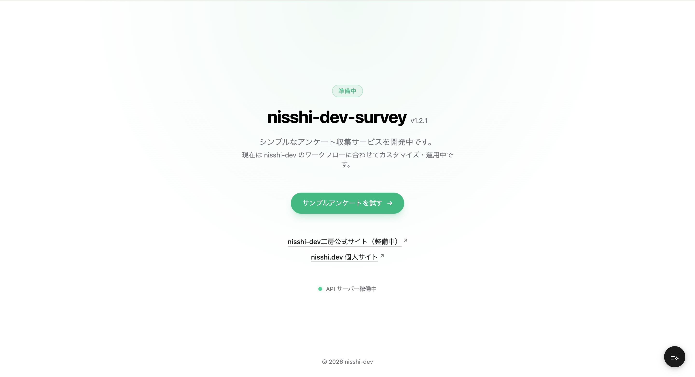
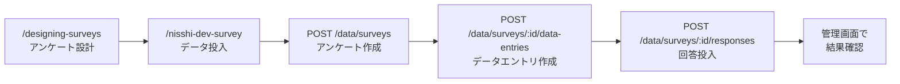
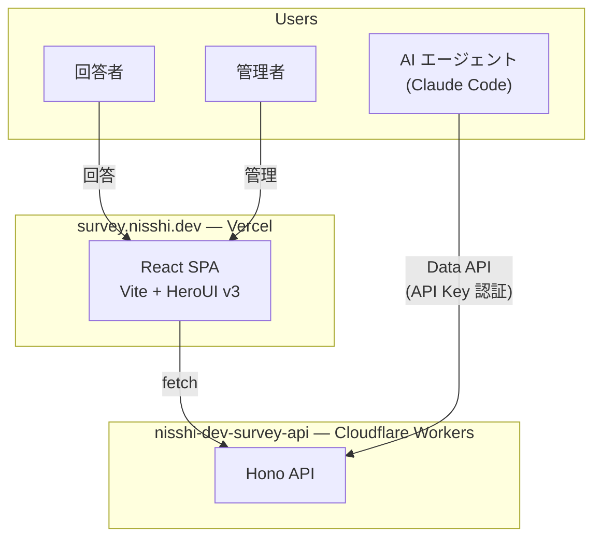

# nisshi-dev-survey

[](https://vercel.com)
[](https://react.dev)
[](https://vite.dev)
[](https://tailwindcss.com)
[](https://www.typescriptlang.org)
[](https://vitest.dev)

Google Forms の軽量版。AI エージェントからアンケート設計〜データ投入まで一気通貫で自動化できる。

**https://survey.nisshi.dev**



### 管理者ダッシュボード

<video src="docs/images/admin-dashboard.mp4" controls muted></video>

### アンケート回答

<video src="docs/images/survey-respond.mp4" controls muted></video>

## Features

| | ポイント | 内容 |
|---|---|---|
| 1 | **AI エージェント統合** | Claude Code スキルでアンケート設計 → 作成 → データエントリ → 回答投入を自動化 |
| 2 | **API ファースト** | OpenAPI ベースの Data API。API Key 認証で任意のツールから操作可能 |
| 3 | **データエントリ方式** | パラメータ付き配布 URL で、バージョン別・イベント別の回答を確実に追跡 |
| 4 | **回答者フレンドリー** | アカウント登録不要。URL を開くだけで即回答 |

## AI エージェント連携

Claude Code のスキルを使い、対話的にアンケートの設計からデータ投入までを自動化できる。



| スキル | 役割 |
|---|---|
| `/designing-surveys` | アンケート設計のベストプラクティスに基づき、質問・回答タイプ・パラメータを設計 |
| `/nisshi-dev-survey` | Data API を使ってアンケート作成・データエントリ作成・回答投入を実行 |

### 使用例

```
あなた: /nisshi-dev-survey でイベント満足度アンケートを作って
Claude: アンケートを設計します。質問は何問くらいを想定していますか？
        ...（対話的に設計）...
Claude: アンケートを作成しました。
        - アンケート ID: abc123
        - 管理画面: https://survey.nisshi.dev/admin/surveys/abc123
        - 回答 URL: https://survey.nisshi.dev/survey/abc123
```

## アーキテクチャ



| | フロントエンド（本リポ） | API |
|---|---|---|
| リポジトリ | `nisshi-dev-survey` | [`nisshi-dev-survey-api`](https://github.com/nisshi-dev/nisshi-dev-survey-api) |
| デプロイ先 | Vercel | Cloudflare Workers |
| Framework | Vite（SPA） | Hono |

## 技術スタック

```
フロントエンド
├─ React 19 + Vite 7
├─ HeroUI v3 beta (React Aria ベース)
├─ Tailwind CSS v4
├─ motion (アニメーション)
├─ react-router-dom v7 (SPA)
├─ SWR (データ取得)
├─ Recharts (グラフ)
├─ Vitest 4 (TDD)
└─ ultracite / Biome (リント・フォーマット)

バックエンド (別リポ)
├─ Hono (API フレームワーク)
├─ Cloudflare Workers
└─ Valibot (スキーマバリデーション)

インフラ
├─ Vercel (フロントエンド)
├─ Cloudflare Workers (API)
└─ Orval (OpenAPI → SWR hooks 自動生成)
```

## セットアップ

### 前提条件

- Node.js 24.x
- npm 11.x

### インストール

```bash
npm install
npm run generate:client  # API 開発サーバー起動済みの場合
```

### 環境変数

| 変数 | 説明 | 必要な場面 |
|---|---|---|
| `VITE_API_URL` | API の URL | 本番ビルド |
| `OPENAPI_URL` | OpenAPI JSON の URL | Vercel ビルド |

## 開発

```bash
# ターミナル1: API（別リポ）
cd nisshi-dev-survey-api && npm run dev  # localhost:8787

# ターミナル2: フロントエンド（本リポ）
npm run dev  # localhost:5173 → /api/* を localhost:8787 にプロキシ
```

### 主要コマンド

| コマンド | 説明 |
|---|---|
| `npm run dev` | 開発サーバー起動 |
| `npm run build` | プロダクションビルド |
| `npm run check` | リント・フォーマット検査 |
| `npm run fix` | 自動修正 |
| `npm run test:run` | テスト実行 |
| `npm run generate:client` | OpenAPI → SWR hooks 生成 |

## Claude Code Skills

このプロジェクトには Claude Code 用のスキルが組み込まれている。

| スキル | 説明 |
|---|---|
| `/nisshi-dev-survey` | Data API でアンケート作成・データエントリ作成・回答投入を自動化 |
| `/designing-surveys` | アンケート設計のベストプラクティスに基づく設計支援 |
| `/test-driven-development` | TDD の Red-Green-Refactor サイクルに従った開発 |
| `/vitest` | Vitest のテスト作成・モック・カバレッジ設定 |
| `/heroui-react` | HeroUI v3 コンポーネントのドキュメント参照・利用 |
| `/web-design-guidelines` | Web Interface Guidelines に基づく UI レビュー |
| `/brainstorming` | 機能実装前の要件・設計の深掘り |
| `/agent-browser` | ブラウザ自動化による Web アプリテスト |

## テスト

TDD（テスト駆動開発）で開発している。実装コードより先にテストを書く。

```bash
npm run test:run       # テストを1回実行
npm test               # ウォッチモードで起動
npm run test:coverage  # カバレッジ付きで実行
```

詳細は [CLAUDE.md](CLAUDE.md) および [docs/](docs/) を参照。
